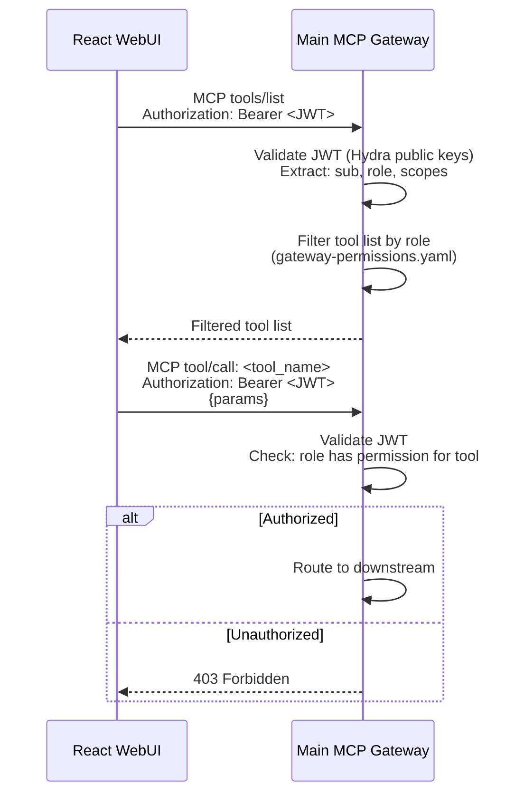
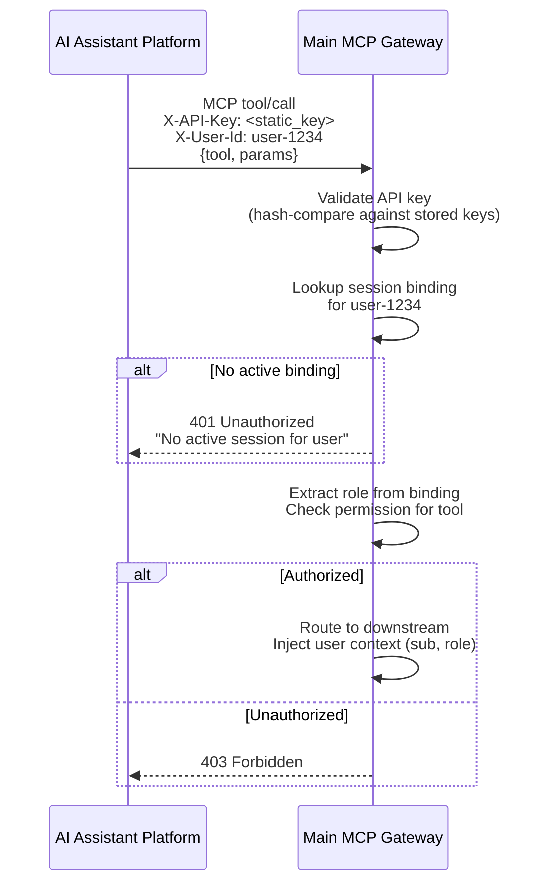
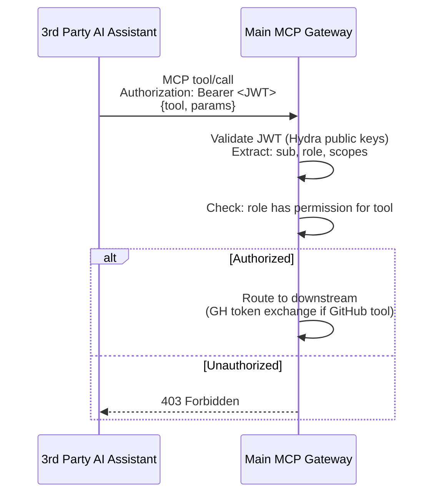
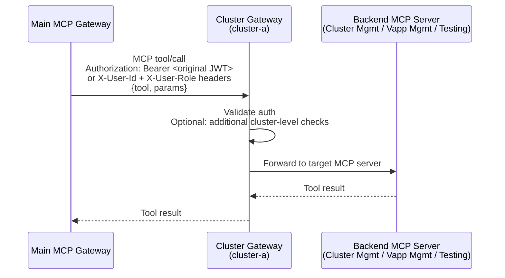
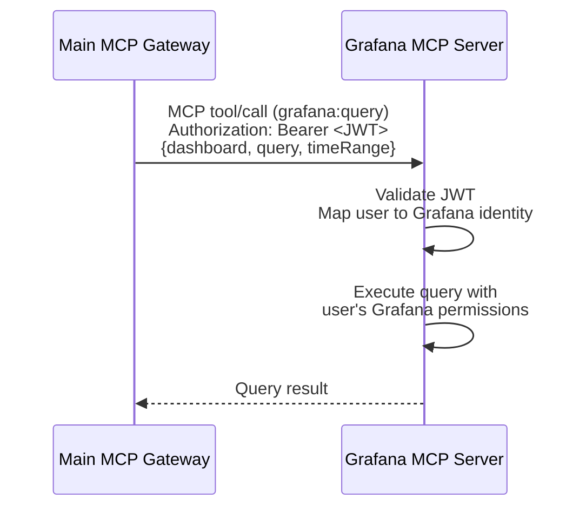
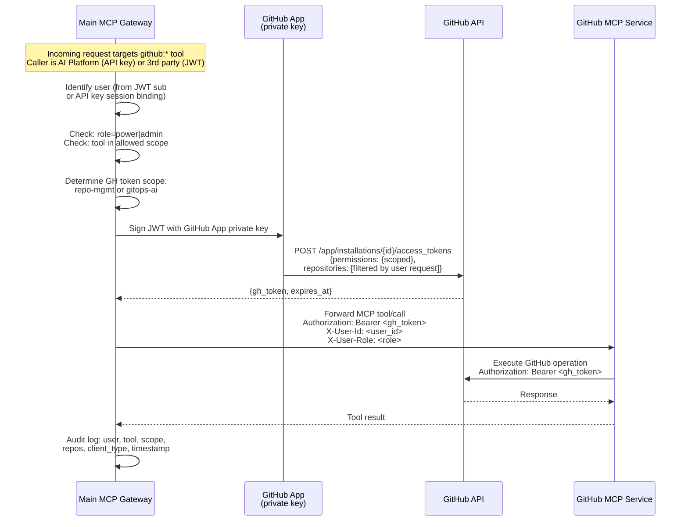
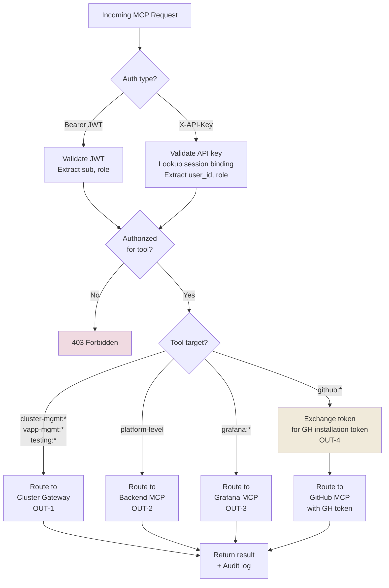

# Main MCP Gateway — In/Out Activity Specification

**Status:** Proposed
**Date:** 2026-03-09
**Related:** ADR-001 Platform Auth Architecture

---

## Overview

The Main MCP Gateway is the single entrypoint for all MCP (Model Context Protocol) traffic. It authenticates callers, enforces RBAC, performs token exchange where needed (e.g., GitHub), and routes requests to the appropriate downstream service or cluster gateway.

This document defines every inbound and outbound activity the gateway handles.

---

## Inbound Activities (Clients → Gateway)

### IN-1: React WebUI — MCP Requests

```
Source:     React WebUI (browser)
Auth:       Authorization: Bearer <JWT>
Protocol:   MCP over HTTPS
Payloads:   tools/list, tool/call
```



**Gateway actions:**
1. Validate JWT signature against Hydra JWKS endpoint (cached)
2. Check `exp`, `aud` claims
3. Extract `sub` (user ID), `ext.role`, `scope`
4. For `tools/list`: return tools filtered by role
5. For `tool/call`: check role permission → route or reject

---

### IN-2: AI Assistant Platform — MCP Requests

```
Source:     AI Assistant Platform
Auth:       X-API-Key: <static_key>
            X-User-Id: <user_id>
Protocol:   MCP over HTTPS
Payloads:   tools/list, tool/call
```



**Gateway actions:**
1. Validate static API key (bcrypt/argon2 hash compare)
2. Rate-limit per API key
3. Lookup session binding table: `(api_key, user_id) → (role, session_token, expires_at)`
4. Reject if binding expired or not found
5. Apply same RBAC as JWT-authenticated users (same permission matrix)
6. If tool targets GitHub MCP → perform GH token exchange (see OUT-4)
7. Route to downstream with user context headers

---

### IN-3: 3rd Party AI Assistant — MCP Requests

```
Source:     3rd Party AI Assistant
Auth:       Authorization: Bearer <JWT>
Protocol:   MCP over HTTPS
Payloads:   tools/list, tool/call
```



**Gateway actions:**
1. Same JWT validation as IN-1 (WebUI)
2. Same RBAC enforcement
3. If tool targets GitHub MCP → perform GH token exchange (see OUT-4)
4. Route to downstream with user context

**Note:** From the gateway's perspective, IN-3 is identical to IN-1 in terms of auth and RBAC. The distinction matters for audit logging (client type) and for GitHub token exchange (the gateway must exchange the JWT for a GH token before routing to GitHub MCP).

---

## Outbound Activities (Gateway → Downstream)

### OUT-1: Route to Cluster Gateways

```
Target:     Per-cluster MCP Gateway (cluster-a, cluster-b, ...)
Auth:       Forwarded JWT or injected user context headers
Protocol:   MCP over HTTPS (internal)
```



**Gateway actions:**
1. Determine target cluster from tool namespace or routing rules
2. Forward the request with auth context (JWT passthrough or injected headers for AI Platform requests)
3. Receive and relay response back to caller

**Routing logic:**

| Tool namespace pattern | Target |
|---|---|
| `cluster-mgmt:*` | Cluster GW for target cluster |
| `vapp-mgmt:*` | Cluster GW for target cluster |
| `testing:*` | Cluster GW for target cluster |
| `grafana:*` | Grafana MCP (direct, see OUT-3) |
| `github:*` | GitHub MCP (via OUT-4 token exchange) |

---

### OUT-2: Route to Backend MCP Servers (Direct)

For backends not behind a cluster gateway (e.g., platform-level services), the main gateway routes directly.

```
Target:     Backend MCP servers (non-cluster-scoped)
Auth:       Forwarded JWT or injected user context
Protocol:   MCP over HTTPS (internal)
```

**Gateway actions:**
1. Forward request with auth context
2. Relay response

---

### OUT-3: Route to In-House MCP Services (Grafana, etc.)

```
Target:     Grafana MCP Server, other in-house MCP services
Auth:       Forwarded JWT with user identity
Protocol:   MCP over HTTPS (internal)
```



**Gateway actions:**
1. Forward JWT as-is
2. Grafana MCP maps platform user to Grafana identity internally

---

### OUT-4: GitHub MCP — Token Exchange + Route

This is the gateway's most complex outbound activity. When an MCP tool call targets GitHub, the gateway **exchanges the caller's credential for a GitHub installation token** before routing to GitHub MCP.

```
Target:     GitHub MCP Service
Auth:       GitHub App installation token (acquired by gateway)
Protocol:   MCP over HTTPS
```



**Gateway actions (step by step):**

1. **Detect GitHub tool** — incoming tool name matches `github:*` namespace
2. **Identify user** —
   - If caller is AI Platform: extract `user_id` from `X-User-Id` header, look up role from session binding
   - If caller is JWT-authenticated: extract `sub` and `role` from JWT claims
3. **RBAC check** — verify `role` is `power` or `admin`
4. **Determine scope** — map the specific tool to a GitHub token scope:
   - `github:create_repo`, `github:push_commit` → `repo-mgmt`
   - `github:commit_chart`, `github:create_pr`, `github:update_manifests` → `gitops-ai`
5. **Acquire GitHub installation token** —
   - Sign a JWT using the GitHub App's private key
   - Call `POST /app/installations/{installation_id}/access_tokens` with scoped permissions and filtered repositories
   - Cache token until expiry (optional, max ~1h)
6. **Forward to GitHub MCP** — inject `Authorization: Bearer <gh_token>` and user context headers
7. **Relay response** — return tool result to caller
8. **Audit log** — record user ID, client type, tool name, GH scope, target repos, timestamp

**Token scope mapping:**

| MCP Tool | GH Scope | GH Permissions |
|---|---|---|
| `github:create_repo` | `repo-mgmt` | `contents:write`, `metadata:read` |
| `github:push_commit` | `repo-mgmt` | `contents:write`, `metadata:read` |
| `github:commit_chart` | `gitops-ai` | `contents:write`, `pull_requests:write`, `metadata:read` |
| `github:create_pr` | `gitops-ai` | `contents:write`, `pull_requests:write`, `metadata:read` |
| `github:update_manifests` | `gitops-ai` | `contents:write`, `metadata:read` |

---

## Cross-Cutting Concerns

### Authentication Summary

| Inbound Client | Auth Method | Identity Resolution |
|---|---|---|
| React WebUI | `Authorization: Bearer <JWT>` | JWT `sub` claim |
| AI Assistant Platform | `X-API-Key` + `X-User-Id` | Session binding table lookup |
| 3rd Party AI Assistant | `Authorization: Bearer <JWT>` | JWT `sub` claim |

### RBAC Enforcement

All inbound requests go through the same permission check pipeline:

```
1. Extract identity (JWT sub or session binding user_id)
2. Extract role (JWT ext.role or session binding role)
3. Load gateway-permissions.yaml
4. For tools/list → filter visible tools by role
5. For tool/call → check role has permission for tool → 403 if not
```

The gateway NEVER blocks tool discovery — it **filters** the list. Unauthorized tools are hidden, not errored on discovery. Direct `tool/call` to an unauthorized tool returns `403`.

### Audit Logging

Every request through the gateway is logged:

```
{
  timestamp: ISO8601,
  request_id: uuid,
  client_type: "webui" | "ai-platform" | "3rd-party",
  user_id: string,
  role: string,
  action: "tools/list" | "tool/call",
  tool: string | null,
  target: "cluster-gw:cluster-a" | "grafana-mcp" | "github-mcp" | ...,
  auth_method: "jwt" | "api-key",
  gh_token_exchanged: boolean,
  gh_scope: string | null,
  result: "success" | "403" | "401" | "error",
  latency_ms: number
}
```

### Rate Limiting

| Client Type | Rate Limit Key | Default |
|---|---|---|
| JWT-authenticated (WebUI, 3rd party) | JWT `sub` claim | Per-user limit |
| AI Platform | API key + `X-User-Id` | Per-key global + per-user |

### GitHub Token Caching (Optional)

The gateway MAY cache GitHub installation tokens to avoid repeated exchange calls:

- **Cache key:** `(user_id, gh_scope, repo_set_hash)`
- **TTL:** min(token.expires_at, 30 minutes)
- **Invalidation:** on role change, on explicit revocation
- **Trade-off:** reduces GitHub API calls but slightly increases blast radius if a cached token needs emergency revocation

---

## Activity Matrix

| Activity ID | Direction | Source / Target | Auth | Token Exchange | Description |
|---|---|---|---|---|---|
| **IN-1** | Inbound | WebUI → GW | JWT | None | WebUI MCP requests (tools/list, tool/call) |
| **IN-2** | Inbound | AI Platform → GW | API key + user_id | None (at inbound) | AI Platform MCP requests |
| **IN-3** | Inbound | 3rd Party AI → GW | JWT | None (at inbound) | 3rd party MCP requests |
| **OUT-1** | Outbound | GW → Cluster GW | JWT passthrough or headers | None | Route to per-cluster gateways |
| **OUT-2** | Outbound | GW → Backend MCP | JWT passthrough or headers | None | Route to non-cluster backends |
| **OUT-3** | Outbound | GW → Grafana MCP | JWT passthrough | None | Route to in-house MCP services |
| **OUT-4** | Outbound | GW → GitHub MCP | GH installation token | **Yes** — API key or JWT → GH token | GitHub token exchange + route |

---

## Request Flow Summary


